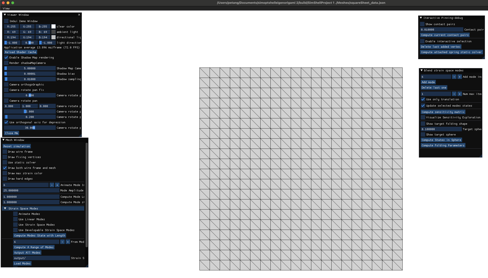

# Modal-Folding
<p align="left">
<a href="https://tangpengbin.github.io/publications/Folding/index.html"></a>
</p>

This is an implementation of [Modal Folding: Discovering Smooth Folding Patterns for Sheet Materials using Strain-Space Modes](https://tangpengbin.github.io/publications/Folding/index.html) [Tang et al. 2024].

If you use this repository in your work, please cite our paper.

```bibtex
@inproceedings{tang2024modal,
title={Modal Folding: Discovering Smooth Folding Patterns for Sheet Materials using Strain-Space Modes},
author={Tang, Pengbin and Hinchet, Ronan and Poranne, Roi and Thomaszewski, Bernhard and Coros, Stelian},
booktitle={ACM SIGGRAPH 2024 Conference Papers},
pages={1--9},
year={2024}
}
```

# Build
Our code can be built on Windows, MacOS, Unbuntu systems.

```console
$ mkdir build
$ cd build
$ cmake ..
$ make -j 8
```

# Usage
After building the project, the project can be run by the following command.

```console
SimShellProject 1 ./Meshes/squareSheet_data.json"
```



Edit the "isPeriodic" and "isReflection" in the config json to choose the no-boundary, periodic, and reflection boundary conditions in the simulation.
